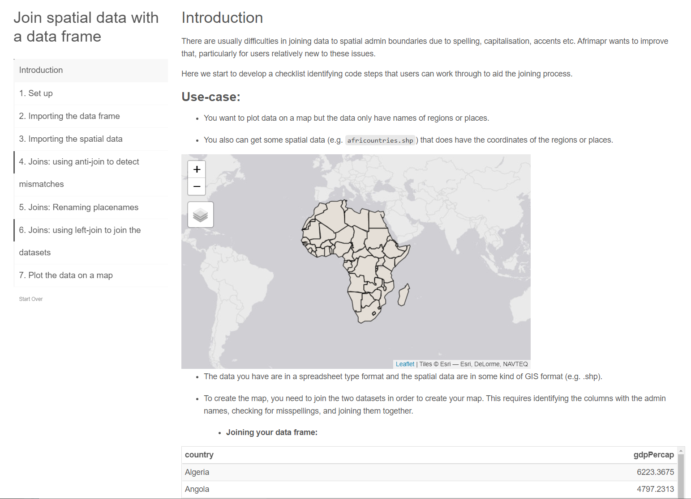

Together with afrimapr I have been building an open access interactive learnr tutorial, **afrijoin** on spatial joins in R. You can track our progress on [GitHub](https://github.com/afrimapr/afrijoin).

