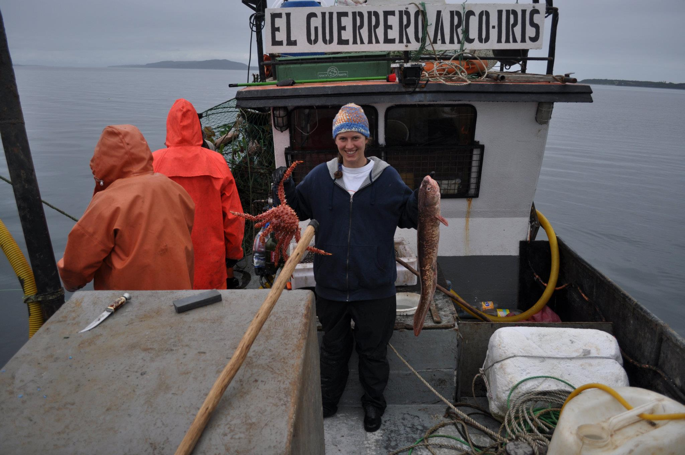

I studied the factors influencing a fisher's catch intention in the Chilean industrial longline fishery for which I was awarded the Margaret Lang Award for best undergraduate dissertation in Marine Biology at the University of St. Andrews. In the same year, I was awarded a small ecological project grant from the British Ecological Society to visit Dr. Rodrigo Wiff at the Instituto de Fomento Pesquero in Valparaíso and Claudio Gatica at the Instituto de Investigación Pesquera (INPESCA) in Talcahuano, Chile to study the reproductive ecology of the female pink cusk-eel (*Genypterus blacodes*: Congrio dorado). 

In the four months I spent in Chile, I participated in a range of field work including aboard a 50m trawler fishing off the coast of Concepción for humboldt squid (*Dosidicus gigas*: Jibia) and 3 days aboard an artisanal vessel in Chiloé fishing for Chilean King Crab (*Lithodes santolla*: Centolla). 

Like the Scottish Haggis, Congrio Dorado has a famous "Ode" written about it by one of Chile's most famous poets, Pablo Neruda [Oda al Caldillo de Congrio](https://www.neruda.uchile.cl/obra/obraodaselementales2.html). 