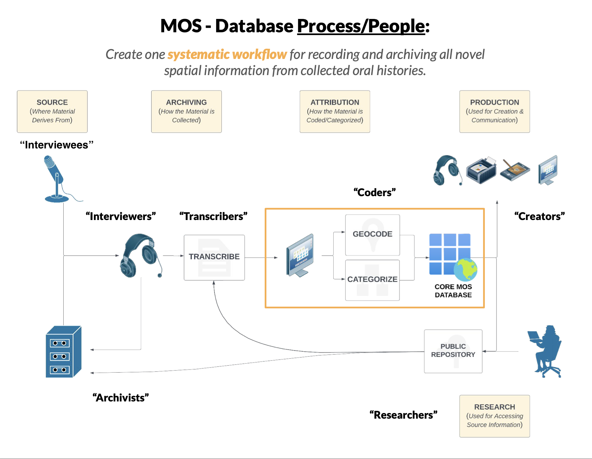
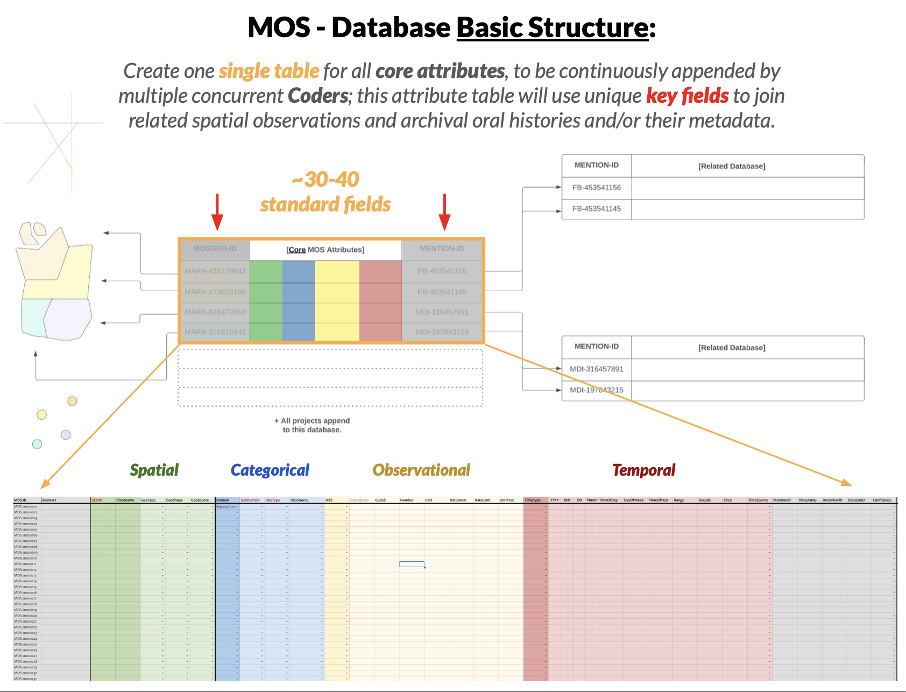
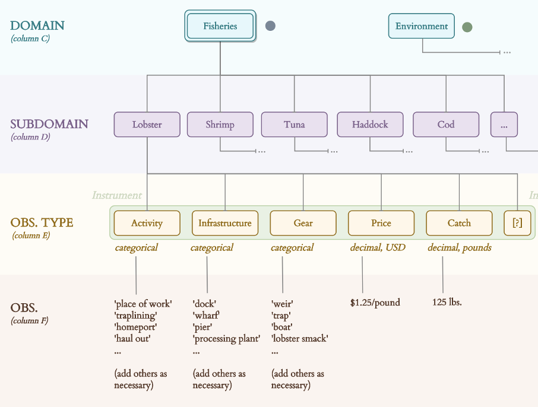
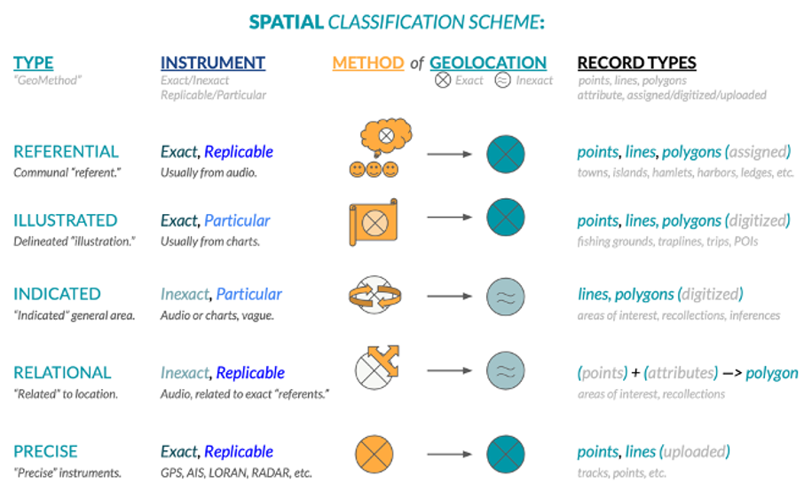

MOS is a collaborative project between the College of the Atlantic, Island Institute, Maine Sea Grant and The First Coast focused on documenting the heritage of Maine island and coastal communities and their connection to the ocean through oral histories. Mapping Ocean Stories' goal is to amplify the voices of coastal communities and unite them to provide a broader picture of the changing environment and adaptations in coastal areas of Downeast Maine over the last century.

Oral histories provide a powerful set of insights into how ecosystems and communities have responded to changing conditions and fish abundance over time. The goal of this project is to study the changes in coastal use through time and space using data science techniques to offer a bird's eye view of coastal Maine over several generations and to deliver these learnings in the form of the Maine Historical Fisheries Atlas (MHFA).

MHFA is a shareable resource of data and maps from biographical and ecological information of fisheries past and present collected in interviews. The atlas we will develop consists of GIS layers created from spatial data mentioned in interviews including the locations of important fisheries and species, such as historical weirs, cod grounds, shrimp tows, clam and worm flats, shellfish farms and seaweed culture lines. In this project we will code and visualize spatial mentions from Frenchman Bay to understand how species distributions and commercial fisheries have changed over time. During this process we will explore:

* What information or features can we use to develop meaningful spatial units (i.e. grounds) to capture use of the coast and bay by various users? 
* What needs to be considered when we characterize spatial mentions in current and historical oral history archives?
* What uses do coastal communities today see for the Maine Historical Fisheries Atlas? What questions are they interested in using it to explore? What uses are important to capture?
* How can text analysis be used to aid the spatial geocoding process?

### Progress

In collaboration with [Rhumbline Maps](https://rhumbline.us) we have been developing a new codebook and spatial methodology to characterize spatial activities in Frenchman and Penobscot Bays. The process begins by conducting interviews with fishermen and other coastal users and archiving the interviews on [Maine Sound and Story](https://mainesoundandstory.com/) as well as working with historical archives from the [Fogler Collection at UMaine](https://archives.library.umaine.edu/repositories/5/resources/2845). Transcribed interviews are then geocoded and the activities are categorized (Figure 1). 

<figure>
    
    <figcaption>Figure 1. Diagram of the mapping ocean stories data analysis workflow.</figcaption>
</figure>

The database is designed to record spatial, categorical, observational and temporal information about each activity (Figure 2). 

<figure>
    
    <figcaption>Figure 2. MOS - Database Basic Structure.</figcaption>
</figure>

Spatial activities are categorized by coders by their domain, subdomain, and observation type to create a set of standardized observations that can be reliably compared later using queries, summaries, and other systematic methods (Figure 3). 

<figure>
    
    <figcaption>Figure 3. Subset of the codebook showing the domain, subdomain, observation type and observation levels for the fisheries domain.</figcaption>
</figure>

The spatial information for each activity is then classified by the geomethod and type of spatial information conveyed (Figure 4).

<figure>
    
    <figcaption>Figure 4. Spatial classification scheme by geomethod.</figcaption>
</figure>